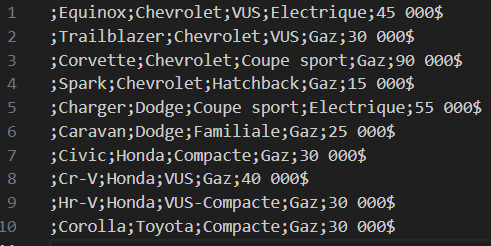
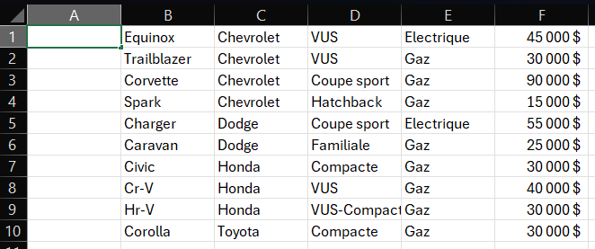
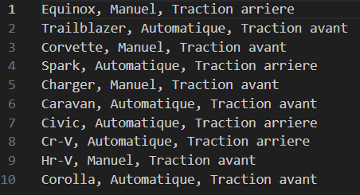

# PROJET 02
Le sélectionneur/filtreur de voitures
## BUT
  À partir d'un inventaire de modèles de voitures, vous serez en mesure de choisir quelles options vous préférez afin de choisir votre prochain véhicule et voir quels modèles correspondent à vos préférences.
# COMMENT UTILISER
## ENTRÉES
### Inventaire créé à partir de 2 types de fichiers:
- ### Fichier .csv:
  Dans un fichier .csv, sur chaque ligne vous devrez inscrire le modèle, la marque, le type, la consommation puis le prix des modèles affichés par le concessionnaire voulu. Bien important de précéder chaque information par un point-virgule ( ; ). Un exemple vous est fournis plus bas. Si vous créez votre .csv dans excel, assurez-vous de laisser la colonne "A" vide.

  Assurez-vous de bien avoir nommé votre fichier "caracteristiques.csv" et de l'enregistrer dans un endroit présent dans le même dossier principal où vous lisez/lancez le code "main.py".
- ### Fichier .txt:
  Dans un fichier .txt, (pour les mêmes voitures sélectionnées pour votre fichier .csv) sur chaque ligne vous devrez inscrire le modèle, sa transmission puis son type de traction. Bien important de séparer chaque information par une virgule ( , ) suivi d'un espace. Un exemple vous est fournis plus bas.

  Assurez-vous de bien avoir nommé votre fichier "caracteristiques.txt" et de l'enregistrer dans un endroit présent dans le même dossier principal où vous lisez/lancez le code "main.py".
## DÉROULEMENT
Une fois vos fichiers créés, vous n'avez qu'à lancer le code "main.py". Plusieurs boîtes textuelles vous demanderons de choisir entre quelques options. 

## SORTIE
Après avoir sélectionné vos préférences, un fichier.txt nommé "resultat.txt" sera créé au même endroit ou le "main.py" se trouve. Ce fichier contient la liste des modèles de véhicule qui correspondent à ce que vous recherchez.

Dans l'éventualité ou aucun des véhicules recueillis dans vos fichiers ne correspondent à vos préférences, le fichier contiendra alors un message vous avisant que ce concessionnaire ne possède aucun véhicule avec les caractéristiques recherchées.
# EXEMPLES DE FICHIERS
### Fichier .csv:

### Fichier .csv dans excel:

### Fichier .txt:

